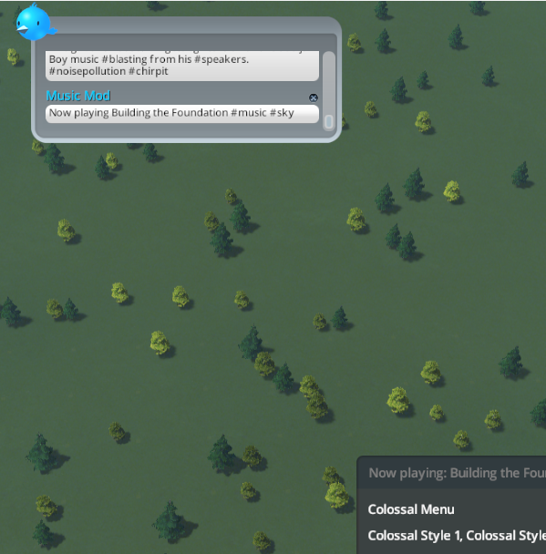
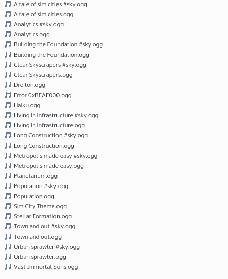

#CSL Music Mod


With CSL Music Mod you can add custom music to Cities: Skylines.

Steam Workshop Link: http://steamcommunity.com/sharedfiles/filedetails/?id=422934383

##Features
- Add custom music to your game
- Converts *.ogg files to Cities: Skylines music files
- Play them randomly or in defined order
- Enable or disable tracks quickly to skip them
- Easy to use ingame panels (Open them with ingame-configurable hotkeys)
- Switch to the next track using a hotkey
- Ingame resorting of tracks (just drag the items in the list)
- Supports vanilla game mood/height music (e.g. if you zoom out, the music changes)
- Add mood/height music just by corretly renaming the music file - mod will configure everything automatically
- Chirpy support - Shows you which track is playing, how to open the panels and music file conversion errors
- ~~Chirps cannot be disabled because Chirpy is not putting a gun to my head~~
- Many features such as automatic music configuration, Chirpy, mood/height music can be easily disabled



##Changelog

###Update 2
- Added setting for non random playback
- Added resorting of music list (drag items to resort them)
- Some UI changes

###Update 1
- Added keybindings to settings panel
- Added volume slider to settings panel
- Added chirp if \*.ogg file could not be converted
- Improved Chirper: Only chirp the current song after you switched tracks fast
- Added more settings for configuration file: Height for 'sky' music changeable, mood for 'bad mood' changeable
- Better algorithm to select next random music track (Should prevent too many repeats)
- Bugfix: Cannot rename objects (houses, persons, ...) because panel pops up

##Adding music files
The mod gets its music files from _CSLMusicMod_Music_ folder (location depends by platform, you can find the folder where many other mods are storing their data).

Just put \*.ogg or \*.raw files into that folder and if you start the game, the music will be used.



###\*.raw files
You can create \*.raw files manually if you want. Just export raw audio data in an audio editor (e.g. Audacity) with following settings:
* Signed 16 bit PCM
* Little Endian byte order
* 2 Channels (Stereo)
* Frequency 44100Hz

##Music files for 'bad mood' and 'sky'
If enabled (see later), the mod can automatically determine the 'type' of a music file, so you don't have to mess with the configuration file.

To determine the type, add #hashtag at the end of the filename (but do not change the extension!).

- \#sky for 'sky'/'hovering above your city' music
- \#bad for 'bad mood' music
 
### Example
Let **MyMusicFile.ogg** (or \*.raw) be your main music file for 'normal' ('good mood') music.

Rename your other music files like this:

- **MyMusicFile #sky.ogg** or **MyMusicFile#sky.ogg** for sky music
- **MyMusicFile #bad.ogg** or **MyMusicFile#bad.ogg** for bad mood music
 

__Note: You must provide a music file for 'normal'/'good' condition. You cannot have songs only for 'bad' and 'sky'__

##Ingame

The mod will be active when you load a city or create a new one. If you keep the default settings, press [N] to switch to the next track and [M] to open the music list.

##Configuration

###Ingame configuration
If you press [M] key (default setting), the music list opens. If you click on "Settings", you can access some settings.


Everything you set there will be written into the configuration file.

###Configuration file
You can also configure the mod using *CSLMusicMod_Settings.ini* 

```
[Music Selection]
# Enable changing music when you are high enough above your city
HeightDependentMusic=True
# Enable changing music when your city is not running well
MoodDependentMusic=True
[Tweaks]
# Enable music while loading. Use this if you have a stuttering problem while loading
MusicWhileLoading=True
[Chirper]
# Enable our beloved leader Chirpy
EnableChirper=True
[Keys]
# Key for switching track
NextTrack=N
# Key for opening the settings/music list
ShowSettings=M
[Music Library]
# Enable automatically determining custom music types using #hashtags
AutoAddMusicTypesForCustomMusic=True
```

###Music Configuration
The mod usually does everything automatically. But you can configure your own list of tracks in *CSLMusicMod_MusicFiles.csv*.

This file is a table, you can open in spreadsheet programs like LibreOffice or Excel. Use tabulator/tab as only delimiter.

Each row in the table is a 'music entry', a collection of music files. You can enable or disable an entry (equivalent to enabling/disabling in ingame user interface). Also you can set a music file for each music type (sky, bad mood) and enable or disable this particular song.

Please don't forget that you have to insert \*.raw files into the table. 

__Note: You must provide a music file for 'normal'/'good' condition. You cannot have songs only for 'bad' and 'sky'__

##Troubleshooting

###There are no configuration files or folders
The mod will create them while loading the map.

###Some \*.ogg files won't convert
This is usually caused by too large ID3 tags. NVorbis (http://nvorbis.codeplex.com/), which is used for decoding \*.ogg files cannot handle too large tags.

Try to remove ID3 tags by using Audacity or programs like EasyTag.

###The music is distorted
Try to convert the *.ogg files with following settings: 44100Hz, Stereo (2 channels)
It could be that NVorbis will keep the sample rate and the channels while converting to *.raw. C:S expects 44100Hz with 2 channels.

###My game is loading too long
This happens because \*.ogg files have to be converted to \*.raw files. This only happens once, so get a cup of tea and wait until it's finished :)

###If I add 'mood' and/or 'sky' music, the music restarts. I want to crossfade the music.
The songs must have almost the same length.

```
long length = this.m_previousMusicStream.Length;
long length2 = this.m_currentMusicStream.Length;
if (Mathf.Abs((float)(length - length2)) < 1024f)
{
    long position = this.m_previousMusicStream.Position;
    if (position < length2)
    {
        this.m_currentMusicStream.Position = position;
    }
}
```

##FAQ

###How does mood/height based music work?
It's working like in the vanilla game. If you are above 1400 height, the 'sky' music will play. If the general happiness is below 40, the 'bad' mood music will play.

##Planned features

- ~~Add ingame settings panel~~
- Add ingame music list reload
- More settings and tweaks
- Extend the mood based music

##Development stuff

###How does this mod work?
You cannot replace the AudioManager without breaking everything, but I found a way to overwrite the music:
AudioManager contains a static field m_audibles, containing IAudibleManagers. These managers are called when a sound is played (```PlayAudio()``` method).

AudioManager (the vanilla one) is an IAudibleManager and redirects PlayAudio the the base class (```PlayAudio_Impl()```) which is overriden by AudioManager. PlayAudio_Impl of AudioManager contains UpdateMusic, which sets m_MusicFile (this is how music is set!).

I register a custom IAudibleManager (```CSLAudioWatcher```) after the AudioManager and overwrite m_MusicFile using .NET Reflection.
The mod also deletes all music files from AudioManager to prevent a "fight" between vanilla music and custom music.

When CSLAudioWatcher is destroyed, the old music files are restored.

###Why no \*.mp3, ... support?
Because I want to ensure that this mod runs on every platform. When I looked for an audio library, I stumbled upon the reason, why .NET did not kill Java: .NET libraries are not really platform independent.

NVorbis is a library written completely in C#, implementing an open standard (Ogg Vorbis), so it should work **everywhere** (at least I hope that it will work everywhere).

###Why are you using NVorbis? Unity3D can read audio, too!
Because I spent hours trying to get Unity3D to load my files correctly (Did not work - just loaded max. 2min of an audio file).

I cannot believe that such a popular engine cannot load an audio file from file system properly.

###Why are you including NVorbis in your source?
Because I want to prevent conflicts with other mods, which may use NVorbis. Also I want to achieve that C:S can compile the source files, which is not possible if NVorbis is not distributed as source.

###What changes did you make in NVorbis?
I Changed the namespaces to prevent conflicts

##Acknowledgements

- Cities: Skylines developers and publisher for this great game
- NVorbis \- I hope you are not mad that I include your code
- Add more

 
